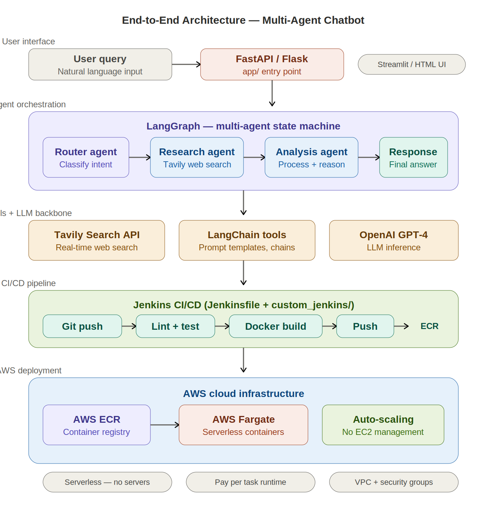

# 🤖 Multi-Agent Chatbot — LangChain + LangGraph with AWS Fargate Deployment

[](https://python.org)
[](https://langchain.com)
[](https://langchain-ai.github.io/langgraph/)
[](https://openai.com)
[](https://docker.com)
[](https://aws.amazon.com/fargate/)
[](https://jenkins.io)
[](LICENSE)

A **production-grade multi-agent chatbot** built with LangChain and LangGraph that orchestrates specialised AI agents (routing, research, analysis) with real-time web search via Tavily. Deployed to **AWS Fargate** (serverless containers) through a Jenkins CI/CD pipeline — no server management required.

---

## 📑 Table of Contents

- [Why This Project](#-why-this-project)
- [Architecture](#-architecture)
- [How the Agents Work](#-how-the-agents-work)
- [Tech Stack](#-tech-stack)
- [Project Structure](#-project-structure)
- [Getting Started](#-getting-started)
- [CI/CD Pipeline](#-cicd-pipeline)
- [AWS Deployment](#-aws-deployment)
- [Future Improvements](#-future-improvements)

---

## 🎯 Why This Project

Single-prompt chatbots are straightforward. **Multi-agent systems** are where AI engineering gets real — you need to design state machines, route between specialised agents, manage tool calls, handle failures gracefully, and deploy the whole thing as a containerised service. This project demonstrates the full stack: LangGraph for agent orchestration, Tavily for grounded web search, and serverless AWS Fargate deployment with Jenkins CI/CD. It's the kind of agentic AI system companies are building right now.

---

## 🏗 Architecture



**Request Flow:** User query → FastAPI/Flask endpoint (`app/`) → LangGraph state machine routes to specialised agents → Router agent classifies intent → Research agent performs Tavily web search → Analysis agent processes and reasons over results → Response agent composes final answer → User receives grounded, multi-step response.

**Deployment Flow:** Git push → Jenkins pipeline (lint, test, Docker build) → Push image to AWS ECR → Deploy as serverless container on AWS Fargate → Auto-scaling with zero server management.

---

## 🧠 How the Agents Work

### LangGraph State Machine

The chatbot uses **LangGraph** to orchestrate multiple specialised agents as nodes in a stateful, directed graph. Unlike a simple chain, this allows conditional routing, loops, and parallel execution.

```
User Query
    │
    ▼
┌─────────────┐
│ Router Agent │ ── Classifies intent, decides which agent(s) to invoke
└──────┬──────┘
       │
   ┌───┴───┐
   ▼       ▼
┌──────┐ ┌──────────┐
│Search│ │ Analysis  │ ── Agents can be invoked in sequence or parallel
│Agent │ │ Agent     │
└──┬───┘ └────┬─────┘
   │          │
   └────┬─────┘
        ▼
┌──────────────┐
│ Response     │ ── Composes final grounded answer
│ Composer     │
└──────────────┘
```

### Agent Roles

| Agent | Role | Tools Used |
|---|---|---|
| **Router** | Classifies user intent, determines which agents to invoke and in what order | LLM reasoning |
| **Research** | Performs real-time web search to gather current, factual information | Tavily Search API |
| **Analysis** | Processes search results, reasons over findings, extracts key insights | LLM chain-of-thought |
| **Response** | Composes a coherent, grounded final answer from all agent outputs | LLM synthesis |

### Why LangGraph over LangChain Agents?

LangChain's `AgentExecutor` runs a single agent in a loop. **LangGraph** gives you a proper state machine — you define nodes (agents), edges (transitions), and conditional routing. This means you can build complex workflows where the router decides at runtime which path to take, agents can pass state to each other, and the graph can loop back for clarification. It's the difference between a chatbot and an **orchestrated AI system**.

### Tavily Search Integration

Instead of hallucinating facts, the Research agent uses the **Tavily Search API** to ground its responses in real-time web data. Tavily is purpose-built for LLM agents — it returns structured, relevant search results optimised for AI consumption (not raw HTML).

---

## 🛠 Tech Stack

### AI & Agent Framework

| Tool | Role |
|---|---|
| **LangChain** | Agent framework — prompt templates, LLM chains, tool integration |
| **LangGraph** | Multi-agent orchestration — stateful directed graph, conditional routing, agent nodes |
| **OpenAI GPT-4** | LLM backbone for reasoning, classification, and response generation |
| **Tavily Search API** | Real-time web search tool — grounded, structured results for agents |

### Application

| Tool | Role |
|---|---|
| **Python 3.10+** | Core language |
| **FastAPI / Flask** | REST API serving the chatbot (`app/` module) |

### Infrastructure & DevOps

| Tool | Role |
|---|---|
| **Docker** | Containerises the full application |
| **AWS ECR** | Elastic Container Registry — stores Docker images |
| **AWS Fargate** | **Serverless containers** — runs Docker without managing EC2 instances, auto-scales, pay-per-task |
| **Jenkins** | CI/CD pipeline — `Jenkinsfile` + `custom_jenkins/` for pipeline config |
| **Git / GitHub** | Version control |

### Why Fargate over EC2?

| | EC2 | Fargate |
|---|---|---|
| **Server management** | You manage instances, patching, scaling | AWS manages everything |
| **Scaling** | Manual or ASG config | Automatic per-task |
| **Cost** | Pay for uptime (even idle) | Pay per task runtime only |
| **Cold start** | None (always running) | ~30s on first request |

For a chatbot with variable traffic, Fargate is the right choice — you don't pay when no one's asking questions, and it scales automatically during spikes.

---

## 📁 Project Structure

```
Multi_Agent_Chatbot/
├── app/                         # Application code
│   ├── __init__.py
│   ├── main.py                  # FastAPI/Flask entry point
│   ├── agents/                  # Agent definitions
│   │   ├── router.py            # Intent classification + routing logic
│   │   ├── researcher.py        # Tavily search agent
│   │   ├── analyzer.py          # Analysis + reasoning agent
│   │   └── responder.py         # Final response composition
│   ├── graph/                   # LangGraph state machine
│   │   └── workflow.py          # Graph definition (nodes, edges, conditions)
│   ├── tools/                   # Tool integrations
│   │   └── tavily_search.py     # Tavily API wrapper
│   └── config.py                # API keys, model config
├── custom_jenkins/              # Jenkins pipeline configuration
├── assets/                      # Architecture diagram
│   └── architecture.png
├── Dockerfile                   # Container build definition
├── Jenkinsfile                  # CI/CD pipeline stages
├── requirements.txt             # Python dependencies
├── setup.py                     # Package setup
├── ERROR                        # Error log / notes
└── README.md
```

---

## 🚀 Getting Started

### Prerequisites

- Python 3.10+
- OpenAI API key
- Tavily API key (free tier available at [tavily.com](https://tavily.com))
- Docker (for containerised deployment)
- AWS account + Jenkins (for Fargate deployment)

### Local Development

```bash
# 1. Clone the repo
git clone https://github.com/nishantrv/Multi_Agent_Chatbot-LangChain_LangGraph_AWSECR_FARGATE_JENKINS_TAVILYSEARCH-.git
cd Multi_Agent_Chatbot-LangChain_LangGraph_AWSECR_FARGATE_JENKINS_TAVILYSEARCH-

# 2. Create virtual environment
python -m venv venv
source venv/bin/activate  # Windows: venv\Scripts\activate

# 3. Install dependencies
pip install -r requirements.txt

# 4. Set environment variables
export OPENAI_API_KEY="sk-..."
export TAVILY_API_KEY="tvly-..."

# 5. Run the app
python -m app.main
# API available at http://localhost:8000
```

### Docker

```bash
docker build -t multi-agent-chatbot .
docker run -p 8000:8000 \
  -e OPENAI_API_KEY="sk-..." \
  -e TAVILY_API_KEY="tvly-..." \
  multi-agent-chatbot
```

---

## 🔄 CI/CD Pipeline

The Jenkins pipeline (`Jenkinsfile`) automates the full deployment lifecycle:

```
Git push → Jenkins triggers
    │
    ├── 1. Checkout code
    ├── 2. Lint + test
    ├── 3. Docker build
    ├── 4. Push to AWS ECR
    └── 5. Deploy to Fargate (update ECS service)
```

The `custom_jenkins/` folder contains additional Jenkins configuration for the pipeline (custom Docker agent, environment setup).

---

## ☁️ AWS Deployment

### Fargate Architecture

```
┌──────────────┐     ┌──────────────┐     ┌──────────────────┐
│   Jenkins     │────▶│   AWS ECR    │────▶│   AWS Fargate    │
│   CI/CD       │     │   (Images)   │     │   (Serverless)   │
└──────────────┘     └──────────────┘     └────────┬─────────┘
                                                    │
                                          ┌─────────┴─────────┐
                                          │  ECS Service       │
                                          │  • Task definition │
                                          │  • Auto-scaling    │
                                          │  • ALB + HTTPS     │
                                          │  • VPC + subnets   │
                                          └───────────────────┘
```

### AWS Resources Required

| Resource | Purpose |
|---|---|
| **ECR repository** | Docker image storage |
| **ECS cluster** | Container orchestration |
| **Fargate tasks** | Serverless container execution |
| **Application Load Balancer** | Traffic routing + HTTPS termination |
| **VPC + subnets** | Network isolation |
| **IAM roles** | Task execution + ECR pull permissions |


## 🤝 Contributing

Contributions and feedback are welcome! Feel free to open an issue or submit a pull request.

---

## 📄 License

This project is licensed under the MIT License — see the [LICENSE](LICENSE) file for details.

---

**Built by [Nishant Ranjan Verma](https://github.com/nishantrv)** | Dublin, Ireland